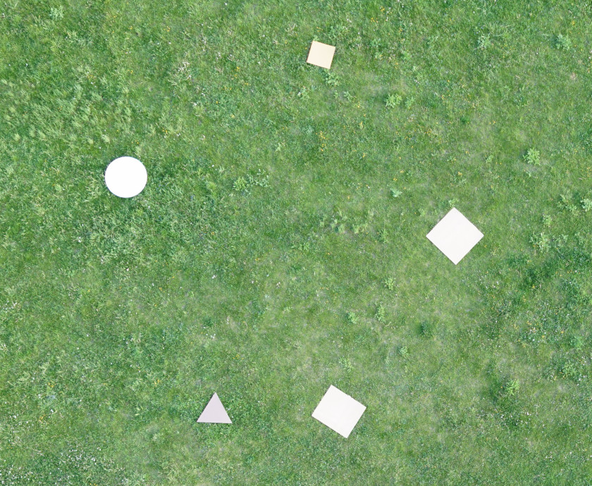
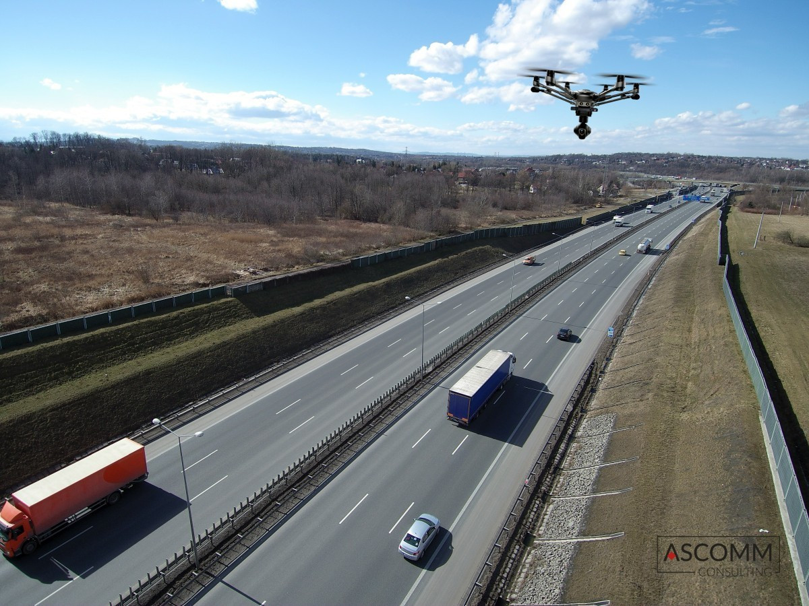

# 2020 IT Recruitment

## Rules
* You have one month to complete a certain task (deadline: 20th of June)
* You can work on the task alone, or in groups of two
* During that month, you can contact us anytime, we'll be happy to answer any questions
* At the 20th of June, you will be presenting the results of your work, then we'll decide if you're good enough

## How to win?
It's not only about "doing a certain thing you're told to do".
Try to think forward, make suggestions on how a certain product/idea
you're working on could be developed further, tell us about the
observations you've made while working on your task.

We appreciate the people who explore the domain of the problem
they're working on, instead of just stratching
the surface to get a bare minimum - show us what you have done!

## The tasks

#

### Detecting markers with OpenCV

We have a dataset of images with 3 different markers - squares, triangles and circles. Example image:

Can you detect the position and shape of the markers? 

**Requirements**:
* Use [OpenCV](https://docs.opencv.org/master/d9/df8/tutorial_root.html)
* Return the position of detected markers (in pixel coordinates)
* Return the shape of the markers (triangle, square, circle)

#

### Web application, easy to use drone mission planner

Imagine you're working on a drone-based monitoring solution for
a company that builds railroad tracks. They want an easy-to-use
web application, that lets them plan missions for their monitoring
drones.

**Required features:**
* A map view (think [leaflet](https://leafletjs.com/))
* Ability to draw a map (preferably using markers)
* Ability to select a fragment of the path (between two markers), and change:
  - The speed at which the drone should fly on this fragment
  - Whether or not the drone should take pictures while on this fragment
* Ability to save and load the created mission to/from a JSON string

**Nice to have features:**
* Usage of a modern web framework (show us what you can do)
* Nice UX

#

### PDF report generator

You are given a CSV/JSON (whatever you prefer) file and a bunch of images.
The file contains description of the images (GPS coordinates, the object visible on the image).
Generate a nice-looking report in PDF, containing the images and descriptions.

Generating mission reports is one of the tasks for a competition we're attending, that's why
we need nice-looking reports.

**Requirements:**
* Easy-readable report
* Nice looking layout, fonts, formatting

#

### A library to convert between Geographic and carthesian coordinates

It's way easier to think and build algorithms, that operate on carthesian 
coordinate system. Unfortunately, drones and planes only operate
on geographic coordinates (since they use GPS), which makes it hard to 
write code that tells, whether a drone is inside a certain square or has
crossed a certain line, drawn on the ground (such operations are
often required on competitions, for stuff like precision landing).

Note that those tasks would be trivial, if we used a carthesian coordinate
system. That's why we need a converter.

**Requirements:**
* Being able to draw basic geometric objects (say, squares, lines, circles) in a carthesian coordinate system (i will refer to this environment as "the map")
* Being able to set how the map translates to the real (GPS-coords based) world, by setting an origin point, and the map's rotation
* Having provided a certain point in GPS coordinates, the library should tell us whether it intersects with the squares and circles on the map, how close it is to the lines we've drawn on the map

**Nice to have features**:
- Visualisation of the map (again, think [leaflet](https://leafletjs.com/))
- A GUI to draw on the map

#

### Simple [web-scraper](https://realpython.com/beautiful-soup-web-scraper-python/) for a website with lots (and lots) of csv files

[This website](http://www.airfoiltools.com/polar/details?polar=xf-ag09-il-50000) has
lots of **polar files**, containing aerodynamical characteristics of
wing profiles (basically some CSV files). Your task is to build a tool that will download all those profiles and
allow people to filter through them.

You can see all the airfoils [here](http://www.airfoiltools.com/search/airfoils). After you click a certain profile,
you get a list of polars, you will need to download each one of them.

**Requirements**

* Download all the profiles from the site (the hardest part, the rest will be easy AF, it's just hard to describe, but we'll talk about that when you're done with downloading)
* Find the max value in all plots of a given characteristic, at a given point on the X axis
* Sort the profiles according to some criterium

**Nice to have features**:

* Easy to use, web-based interface (think React, Heroku, Github Pages)

#

### GTA V scripting/environment modeling (for real, this is not a joke)

We need training data for neural networks, and it turns out
that they work surprisingly good on the datasets made in GTA V (and GTA V is going to be avialable for free on the Epic Store, which is a nice thing).

We need a dataset consisting of pictures of roads, filled with cars,
taken from the height of 10-30 meters. Like this picture:

The dataset will be then used to train a neural network to detect bouding boxes
around the vehicles.

**Requirements:**
- Provide ~5 minutes of video of a road filled with vehicles, camera moving across different angles (you can automate the process, GTA V supports some scripting, but you can use any crazy method that works for you)
- Video must be recorded from the height of 10 to 30 meters
- The vehicles should vary - different colours, different cars

**Nice to have features:**
- Use police cars and ambulances in your scenes (we have to recognise them for a competition we're attending)

#

### A web application for video streaming

Let's say we have a drone with a camera, and an internet connection. We want to stream
the video from the drone (You can simply use a Raspberry Pi with any camera) to a web server.

The server will then:
- Allow us to watch the incoming stream from a web page
- Save the incoming stream to a file

Think [video.js](https://videojs.com/), [ffmpeg](https://www.ffmpeg.org/), [webrtc](https://www.html5rocks.com/en/tutorials/webrtc/basics/)

**Requirements**
- At least 480p, fluid video stream
- Doesn't have to work on mobile, but has to work on a desktop browser

**Nice to have features**
- a resolution higher than 480p (720p is the target)
- a nice deployment method (linux package or docker)
- the stream will also be forwarded to a neural network, that detects people on the video. Can you think how to achieve that? The network takes in image frames (we will we processing about 1/20 of the frames)

#

### Club website updates

Our [website](http://www.akl.pwr.edu.pl) is written in React (not by a WebDev proffesional, but I did my best).
This is more of a creativity-focued task. If you can think of any ways to improve the site (for example, you can design
the members tab or get translation running), show us what you can do, we can give you the site's repo.

#

### Airfoil analysis tool
Our mechanical division,have asked us to make tool to help them match their calculations and graphs to existing airfoils.
There is a website http://airfoiltools.com/ with 1636 diffrent airfoils,and your task is to make an application for searching best matching foils.Every airfoil have own data file with 7 seven diffrent variables.Mechanical division gives us their ideal charectaristcs(jpg or data sheet) we have to find airfoils with similar properties and we are only looking for airfoils polars with Reynolds number of 400k (500k)
A polar curve is a graph which contrasts the sink rate of an aircraft (typically a glider) with its horizontal speed. 

**Requirements:**
 - Only CL/CD graphs matching
 - Input as image or data set

**Nice to have features:**
 - Using more than one graph to match airfoils

#
